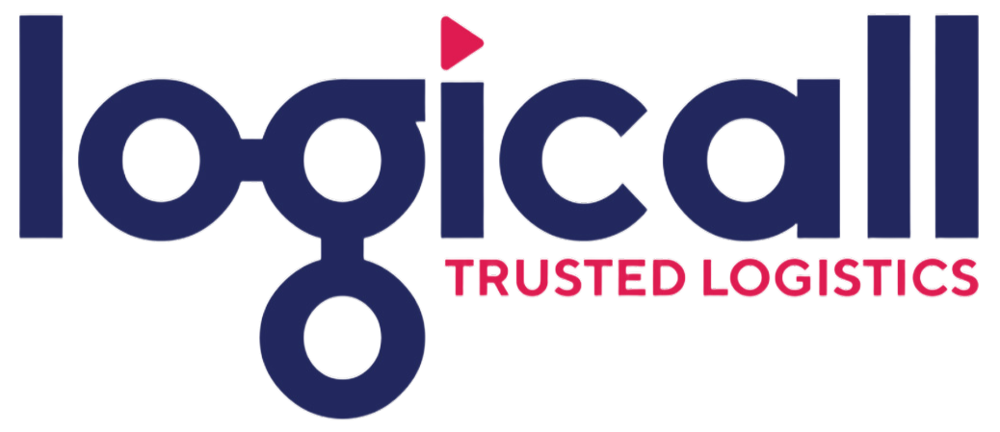

<h1 align="center">Logicall AI Package Tracking</h1>

  
  

A group project for tracking boxes, products and their barcodes using on-site cameras. Designed for Logicall (https://logicall.com) through Fontys ICT.

<h2 align="center">Assignment</h2>

Logicall receives over 150,000 “uncontrolled” returns per month. These boxes need to be unpacked and registered within 2 days of being received. A manual approach would require a significant amount of resources, such as time and labor.
Our assignment is to automate this process.

First, the boxes are scanned, then opened, and the items inside are placed on a conveyor belt. Next, the items pass under cameras, which capture their barcodes for identification. Our goal is to link each box to the items it contained and record those items in a database.

<h2 align="center">Our Solution</h2>

We visited the company grounds to collect data by recording videos of the unpacking process. Afterwards, we extracted frames from the videos and annotated them using Roboflow to create a labeled dataset. Using this dataset, we trained a custom YOLO model to detect boxes and products and connect each box to the item it contains. Additionally, we incorporated a pre-trained COCO model for person detection to ensure accurate distinction between the objects each person is interacting with.

  

After linking each box to its items, we scan each item's barcode. Our solution works with both the collected data and real-time input.

  

After the barcode detection is complete, we save the data into a CSV file.

<h2 align="center">Technologies used:</h2>

  
  
  
  
  
  
  

